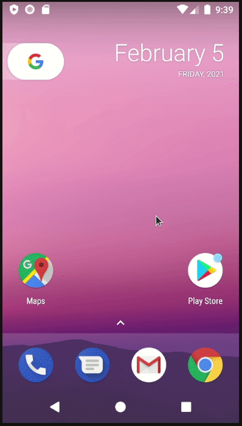
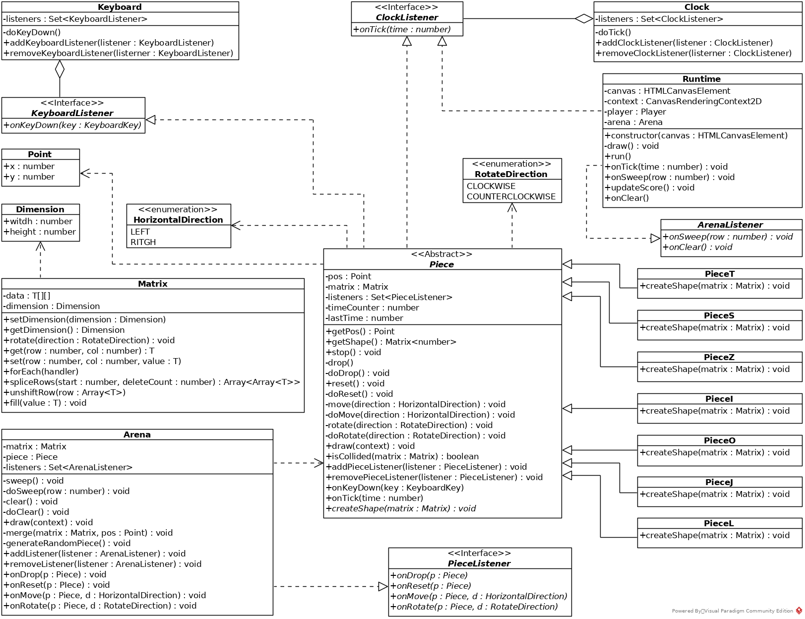

# tetris - [](https://travis-ci.com/paulosales/tetris)  [](https://codecov.io/gh/paulosales/tetris) 

> A Tetris web app game.

## Demo

A demo of the game can be founded at [http://tetris.paulosales.com.br/](http://tetris.paulosales.com.br/)

## Play on your mobile

Tetris is a Progressive Web App, so you can install it on your mobile phone e play offline.

The animation below shows how to install the Tetris as a PWA:


## Code explanation

You wanna know more about how this game was built? Please, visit the article [Designing and creating the Tetris game in Typescript](https://medium.com/@paulosales_17259/designing-and-creating-the-tetris-game-in-typescript-9ab6ee7e5cf1?sk=2f3554fa43abdb0132e5d3275f436050) at Medium.

## Tech stack

1. [Typescript](https://www.typescriptlang.org/)
2. [Jest](https://jestjs.io/)
3. [Webpack](https://webpack.js.org/)

## Building

This game is coded in Typescript, so you have to transpile it to the JavaScript bundle file.
It's possible to generate two kinds of bundles: The development and the production version.

To generate the development bundle type:

```bash
yarn build
```

It also generates a map file that helps to debug the TypeScript code.

To generate the production bundle type:

```bash
yarn build-prod
```

The bundle will be generated in the folder `dist`.

## Class diagram



## Code formatting and linting

We have Eslint and Prettier configured to provides code pattern checking and code formatting.

To check code pattern adherence type:

```bash
yarn lint
```

To format the code type:

```bash
yarn format
```

Code formatting and pattern adherence commands will be triggered every time you commit to your git repository.

## Testing

We have three test configuration types: Watching tests, Coverage tests, and Debug tests.

### Watching tests

The watching tests are tests that automatically rerun when you change the source code. To start this test just type:

```bash
yarn test
```

### Coverage tests

The coverage tests generate test coverage data.
The coverage data will be generated in the folder `coverage`.

To generate the coverage test, type:

```bash
yarn test:coverage
```

### Debug tests

The debug test have the node flag `--inspect-brk` enabled. It means that when you trigger this kind of test, it will be waiting for a debugger to connect to the execution.

To trigger this kind of test, type:

```bash
yarn test:debug
```

You can use Google Chrome to debug the test. To do that just type `chrome://inspect` in the Google Chrome address bar and click in the link Inspect in the Remote Target section.

## License

[MIT](https://github.com/paulosales/tetris/blob/master/LICENSE) © [paulosales](https://github.com/paulosales/).
